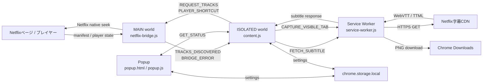

# Netflix Dual Subtitles 設計・実装

## 1. 文書の目的

本書は、Chrome拡張「Netflix Dual Subtitles JKL Capture」の全体設計と現行実装を説明する。対象はバージョン `1.0.0` である。

利用者向けの導入・操作方法は `README.md`、実Netflixでの受け入れ確認項目は `MANUAL_TESTS.md`、リリース単位の変更履歴は `CHANGELOG.md` を参照する。本書では、各機能がどの実行コンテキストで動き、どのようにデータを受け渡し、Netflix固有処理や権限をどこに閉じ込めているかを中心に扱う。

## 2. プロダクト概要

本拡張は、Netflixの再生画面にNetflix提供の日本語字幕と英語字幕を同時表示する、ビルド不要のManifest V3 Chrome拡張である。補助機能として、再生操作用の `J/K/L` と、字幕が見えている状態をPNG保存する `C` を提供する。

主な機能は次のとおりである。

- 日本語・英語字幕の同時表示
- 上段言語、文字サイズ、表示位置の設定
- `J`: 10秒戻る
- `K`: 再生・一時停止
- `L`: 10秒進む
- `C`: 字幕表示を固定して表示中タブをPNG保存
- 日本語・英語トラックの取得状態表示
- DRM等による黒画像の可能性の検出と警告

次の処理は行わない。

- 機械翻訳や外部字幕サービスの利用
- DRM回避や保護された映像パイプラインの変更
- 字幕本文、視聴履歴、画像、Cookie、トークンの永続化
- 分析、広告、テレメトリ、外部サーバーへの送信

## 3. 対象環境と前提

- 最新のGoogle Chrome（Windows）
- Manifest V3
- Chrome 120以降
- `https://www.netflix.com/*` の再生ページ
- Node.js 20以降（開発時のみ。24 LTS推奨）
- npmのランタイム依存関係なし

Netflix連携には公開APIではなく、Netflixページのレスポンスと非公開プレイヤー状態を利用する。このため、Netflix側の変更で動作しなくなる可能性があり、互換性は実Netflixで継続的に確認する必要がある。

## 4. 設計原則

### 4.1 build-free

ソースはそのままChromeが読み込むES Modulesと通常のJavaScriptで構成する。バンドラー、トランスパイラー、フレームワークは使用しない。

### 4.2 Netflix依存処理の隔離

非公開プレイヤーAPI、マニフェスト形状、Netflix内部オブジェクトの探索、ネイティブなシーク操作は `src/page/netflix-bridge.js` に集約する。それ以外のモジュールはNetflix内部構造を前提にしない。

### 4.3 実行コンテキスト間の最小通信

MAIN worldとISOLATED worldの間では `window.postMessage` を使用する。メッセージは送信元、origin、識別子、type、payloadを検証し、必要な情報だけを渡す。

### 4.4 最小限の保存

`chrome.storage.local` に保存するのは表示・操作設定だけである。字幕キュー、トラックURL、作品情報、視聴位置、キャプチャ内容は保存しない。

### 4.5 復旧可能なUI変更

Netflix標準字幕は、拡張字幕を1言語以上正常に準備できた場合だけ非表示にする。拡張OFF、ページ離脱、字幕取得失敗時には標準字幕を残す、または復元する。

### 4.6 SPAセッション分離

Netflix内遷移やエピソード変更時に世代番号を更新し、古い非同期字幕取得結果が新しい再生セッションを上書きしないようにする。

## 5. 全体アーキテクチャ



## 6. 実行コンテキストと責務

| コンポーネント | 実行場所 | 主な責務 |
| --- | --- | --- |
| `manifest.json` | Chrome | 権限、コンテンツスクリプト、Service Worker、Popupの宣言 |
| `src/page/netflix-bridge.js` | ページのMAIN world | Netflixマニフェスト観測、内部プレイヤーからのトラック解決、Netflixネイティブシーク |
| `src/content/content.js` | 拡張のISOLATED world | 字幕取得指示、パース、描画、設定反映、キー入力、キャプチャ制御、公開ステータス |
| `src/background/service-worker.js` | 拡張Service Worker | 字幕CDN取得、表示中タブのキャプチャ、黒画像判定、PNGダウンロード |
| `src/shared/core.js` | Content / Service Worker / Popup / Test | DOMやChrome APIに依存しない純粋ロジック |
| `src/popup/*` | 拡張Popup | 設定UI、トラック状態表示、任意キャプチャ権限の要求 |

## 7. 起動シーケンス

1. Chromeが `document_start` で `netflix-bridge.js` をMAIN worldへ注入する。
2. 続いて `content.js` をISOLATED worldへ注入する。
3. `content.js` は `chrome.storage.local` から設定を読み込み、Shadow DOMオーバーレイを準備する。
4. `content.js` が `REQUEST_TRACKS` を送る。
5. `netflix-bridge.js` はキャッシュ済みトラックを返すか、プレイヤー探索を開始する。
6. トラック発見後、`TRACKS_DISCOVERED` が `content.js` へ送られる。
7. `content.js` は日本語・英語の優先トラックを選び、Service Worker経由で字幕本文を取得する。
8. 字幕をパースしてキュー配列へ格納し、`requestAnimationFrame` ループで現在時刻に合う字幕を描画する。

## 8. 字幕トラック検出

### 8.1 マニフェスト観測

`netflix-bridge.js` はページロードの初期段階で `window.fetch` と `XMLHttpRequest` をラップする。URLに `manifest`、`playapi`、`metadata` を含むJSONレスポンスだけを複製・解析する。

解析では、オブジェクトのキー名が `timedtext`、`subtitle`、`caption` に該当する配列だけをトラック候補とする。単に言語とURLを持つ配列をすべて字幕扱いしないため、音声ストリームを字幕と誤認しない。

URLの形式は次の順で優先する。

1. `webvtt-lssdh-ios8`
2. `webvtt-lssdh`
3. `dfxp-ls-sdh`
4. `simplesdh`
5. その他のトラック内URL

### 8.2 暗号化マニフェスト時のプレイヤー探索

マニフェストから直接URLを取得できない場合に備え、Netflix内部プレイヤーも使用する。

1. `window.netflix.appContext.state.playerApp.getAPI().videoPlayer` からプレイヤーマネージャーを取得する。
2. `watch` を含む最新セッションを優先し、現在のVideo Playerを特定する。
3. `getTimedTextTrackList()` から日本語・英語の候補を選ぶ。
4. 各候補を一時的に `setTimedTextTrack()` する。
5. 解決済みURLが格納される `window.netflix.player.MediaSession` 以下を探索する。
6. `trackId` が一致するHTTPS URLを取得する。
7. 探索終了時に、元の字幕トラックまたは「字幕なし」へ必ず復元する。

内部オブジェクト探索は次の制限を設ける。

- 深さ上限: 16
- 訪問オブジェクト上限: 100,000
- `WeakSet` による循環参照防止
- 字幕候補配列は `trackId` とURL配列の形状で判定
- URL解決待機は250ms間隔、最大48回
- 起動時の再探索は最大30秒

この処理はNetflixの非公開実装に依存するため、アダプター変更時に最も壊れやすい箇所である。

### 8.3 トラック正規化と選択

トラックは次の形へ正規化する。

```js
{
  id: string,
  language: string,
  label: string,
  isSdh: boolean,
  url: string
}
```

言語選択規則は次のとおりである。

1. `ja` / `en` の完全一致
2. `ja-JP` / `en-US` などの地域変種
3. 同順位なら通常字幕
4. 通常字幕がなければSDH/CC

存在しない言語は `unavailable` とし、翻訳や別言語による代替はしない。

## 9. コンテキスト間メッセージ

ページとContent Script間のメッセージには共通の `source: "netflix-dual-subtitles"` を付ける。

| type | 方向 | payload | 用途 |
| --- | --- | --- | --- |
| `REQUEST_TRACKS` | Content → Bridge | `{}` | トラックの再通知・再探索を依頼 |
| `TRACKS_DISCOVERED` | Bridge → Content | `{ tracks }` | 正規化済みトラックを通知 |
| `BRIDGE_ERROR` | Bridge → Content | `{ code, detail? }` | マニフェストまたはプレイヤー探索エラー |
| `PLAYER_SHORTCUT` | Content → Bridge | `{ action }` | Netflixネイティブシークを依頼 |

受信時は `event.source === window`、`event.origin === location.origin`、共通source、既知typeを検査する。字幕URLはBridgeとService Workerの両方でHTTPSかつ許可ホストかを検証する。

Content ScriptとService Worker間では `chrome.runtime.sendMessage` を使用する。

| type | 用途 |
| --- | --- |
| `FETCH_SUBTITLE` | 字幕URLを検証・取得して本文とContent-Typeを返す |
| `CAPTURE_VISIBLE_TAB` | 表示中タブをPNG化し、ダウンロードして結果を返す |
| `GET_STATUS` | PopupがContent Scriptの公開状態を取得する |

## 10. 字幕ファイル取得

字幕本文はページのMAIN worldから直接取得せず、Service Workerで取得する。これにより、Netflixページをoriginとする通常のFetchで発生するCORS制約を避ける。

Service Workerは次を検証する。

- 呼び出し元タブが `https://www.netflix.com/` であること
- URLがHTTPSであること
- ホストが `netflix.com`、`nflxvideo.net`、`nflxso.net`、`nflximg.net` のいずれか、またはそのサブドメインであること
- HTTPレスポンスが成功であること
- 字幕本文が5,000,000文字以下であること

取得時は `credentials: "omit"` とし、NetflixのCookieや認証情報を字幕CDNへ明示的に付加しない。署名付きURLはメモリ内だけで扱い、ストレージやログへ保存しない。

## 11. 字幕パース

字幕パースは `src/shared/core.js` にある純粋関数で行う。

### 11.1 対応形式

- WebVTT
- TTML / DFXP / XML

Content-Typeと本文シグネチャの両方から形式を判定する。未知形式は空配列を返し、Content Script側でエラー状態にする。推測によるパースは行わない。

### 11.2 対応時刻形式

- `HH:MM:SS.mmm`
- `MM:SS,mmm`
- `ms`、`s`、`m`、`h` のoffset time
- `f` のframe time
- `t` のtick time
- 4要素のフレーム付きclock time

NetflixのTTMLでは `ttp:tickRate="10000000"` とtick時刻が使われることがある。パーサーは文書の `tickRate` と `frameRate` を読み、ミリ秒へ換算する。

### 11.3 テキスト正規化

- `<br>` と名前空間付き`br`を改行へ変換
- その他のタグを除去
- 基本的なHTML/XML entityをデコード
- 連続空白を整理
- 空キューや終了時刻が開始時刻以下のキューを破棄

## 12. 字幕表示

Content Scriptは独自要素 `<netflix-dual-subtitles>` を作り、closed Shadow DOM内へ字幕と通知を配置する。

Shadow DOMを使う理由は次のとおりである。

- Netflix側CSSとの衝突を抑える
- Netflix側DOM変更の影響を局所化する
- オーバーレイ内部をページスクリプトから直接操作されにくくする

描画は `requestAnimationFrame` ごとに最大表示面積の`video`要素を選び、`currentTime` をミリ秒に変換する。現在時刻に重なるキューを二分探索で探し、最大20件遡って重複を除去したテキストを表示する。

日本語と英語の上下順は `upperLanguage` で決まり、位置とサイズはCSSクラスで切り替える。字幕要素は `pointer-events: none` であり、Netflix操作を妨げない。

Netflix標準字幕は、拡張が有効で、少なくとも一方の言語が `ready` の場合だけCSSで非表示にする。両言語の取得に失敗している間は標準字幕を隠さない。

## 13. SPA・エピソード遷移

`MutationObserver` でDOMとURLを監視する。URL変更時は次を実行する。

- `sessionGeneration` を増加
- 日本語・英語キューを破棄
- トラック一覧を破棄
- 状態を `searching` へ戻す
- 直近エラーを消去
- 標準字幕の表示状態を再評価
- Bridgeへ新しいトラック探索を依頼

字幕取得開始時に保存した世代番号と、完了時の世代番号が異なる場合、その取得結果は破棄する。これにより、前エピソードの遅延レスポンスが新エピソードへ混入しない。

## 14. キーボード操作

キーイベントはWindowのcapture phaseで受け取る。

| キー | action | 実装 |
| --- | --- | --- |
| `J` | `seek-backward` | Bridgeへ依頼し、Netflixへ左矢印キーイベントを送る |
| `K` | `toggle-playback` | 最大表示面積のvideoへ `play()` / `pause()` |
| `L` | `seek-forward` | Bridgeへ依頼し、Netflixへ右矢印キーイベントを送る |
| `C` | `capture` | 字幕を固定してキャプチャ処理を開始 |

`J/L` で `video.currentTime` を直接変更しないのは、Netflix側の再生管理と不整合を起こし、Netflixエラー `M7375` につながる場合があるためである。Netflixネイティブの左右矢印操作に委譲することで、Netflix自身のシーク処理を使用する。

長押し時は `J/L` だけを反復可能にし、`K` と `C` は反復イベントを無視する。

次の場合はショートカットを処理しない。

- 拡張またはショートカット設定がOFF
- video要素がない
- Ctrl、Alt、Metaとの組み合わせ
- input、textarea、select、contenteditableを操作中
- ダイアログ内にフォーカスがある
- 可視のmodal dialogが存在する

非表示ダイアログは `getClientRects()`、`aria-hidden`、computed styleで除外する。Netflixが非表示ダイアログをDOMに残していてもキー操作を止めないためである。

## 15. キャプチャ

### 15.1 Content Script側

1. キャプチャ開始時刻の日本語・英語字幕を `capturedCueText` に固定する。
2. 再生中なら一時停止する。
3. 2回の `requestAnimationFrame` を待ち、字幕の描画を確定する。
4. 作品名、エピソード、再生時刻、取得日時からファイル名を生成する。
5. Service Workerへ `CAPTURE_VISIBLE_TAB` を送る。
6. 成功・失敗・3秒タイムアウトのいずれでも固定字幕を解除する。
7. 開始前に再生中だった場合だけ再生を再開する。

ファイル名はWindowsで使用できない文字を置換し、既定では次の形になる。

```text
Netflix Captures/<作品>_<エピソード>_<HH-MM-SS>_<YYYYMMDD-HHMMSS>.png
```

### 15.2 Service Worker側

1. 呼び出し元がNetflixタブであることを確認する。
2. `chrome.tabs.captureVisibleTab()` で表示中タブをPNG Data URLへ変換する。
3. 画像中央付近を縮小して黒画像らしさを判定する。
4. `chrome.downloads.download()` で保存する。
5. download IDと黒画像判定をContent Scriptへ返す。

DRM保護により映像部分が黒くなる場合でも、PNG保存自体は止めない。黒画像判定は利用者への助言であり、DRM回避や完全な判定を目的としない。

### 15.3 黒画像判定

- 画像の中央領域を対象
- 縦横を約50%へ縮小
- 4ピクセルおきにサンプリング
- alphaが220未満のピクセルは除外
- 輝度5以下が95%以上なら黒画像の可能性あり

## 16. Popupと設定

設定の既定値は次のとおりである。

```js
{
  enabled: true,
  upperLanguage: "ja",
  fontSize: "medium",
  position: "bottom",
  shortcutsEnabled: true,
  downloadSubdirectory: "Netflix Captures"
}
```

保存時・読み込み時には `normalizeSettings()` を通し、未知値を既定値へ戻し、保存先文字列をサニタイズする。`chrome.storage.onChanged` によりNetflixタブへ即時反映する。

PopupはContent Scriptへ `GET_STATUS` を送り、次を表示する。

- プレイヤー検出有無
- 日本語・英語の `searching` / `loading` / `ready` / `unavailable` / `error`
- 直近エラーの有無

キャプチャ権限ボタンは `chrome.permissions.contains()` で任意権限の状態を確認し、未許可時だけ `chrome.permissions.request()` を実行する。

## 17. 権限設計

| 権限 | 種別 | 用途 |
| --- | --- | --- |
| `storage` | 必須 | 表示・操作設定の保存 |
| `downloads` | 必須 | PNGの保存 |
| `activeTab` | 必須 | Popup操作を起点とする一時的なタブキャプチャ権限 |
| `https://www.netflix.com/*` | 必須host | Content Script、ページ連携、Netflixタブ確認 |
| Netflix CDN 3ドメイン | 必須host | Service Workerによる字幕ファイル取得 |
| `<all_urls>` | 任意host | ページ上の `C` キーから `captureVisibleTab()` を呼ぶために利用者が明示許可 |

`captureVisibleTab()` は `activeTab` または広いhost権限を要求する。`activeTab` は拡張アイコンなどの明示的なユーザー操作で一時付与されるが、ページ上で捕捉した単独の `C` キーはChrome拡張のaction invocationではない。そのため、任意の `<all_urls>` をPopupから明示的に要求する設計としている。

`<all_urls>` は広い権限であるため必須権限にはせず、未許可でも字幕表示と `J/K/L` は利用できる。実装側でもキャプチャ・字幕取得メッセージの送信元をNetflixタブに限定している。

## 18. セキュリティ境界

### 18.1 ページから来る情報は信頼しない

- `window.postMessage` のsourceとoriginを検証
- 既知のmessage typeだけを処理
- URLは受信後に再度パース
- HTTPS以外を拒否
- Netflix/CDN allowlist外を拒否
- Service Workerで送信元タブを再検証

### 18.2 応答サイズを制限する

字幕レスポンスは5,000,000文字を上限とし、誤った大容量リソースの読み込みを防ぐ。

### 18.3 パスをサニタイズする

保存先とファイル名からWindows禁止文字、制御文字、危険な相対パス表現を除去する。Service Workerでも最終保存パスを再サニタイズする。

### 18.4 機密情報を残さない

署名付き字幕URL、字幕本文、マニフェスト本文は永続化しない。URLやレスポンス全体をログ出力しない。

## 19. 状態とエラー処理

主要状態はContent Scriptのメモリ内に保持する。

| 状態 | 内容 |
| --- | --- |
| `settings` | 正規化済み設定 |
| `currentTracks` | 現セッションのトラック一覧 |
| `cuesByLanguage` | 日本語・英語のパース済みキュー |
| `trackState` | 言語別取得状態 |
| `lastError` | Popupへ公開する直近エラーコード |
| `sessionGeneration` | SPA遷移の世代番号 |
| `capturedCueText` | キャプチャ中だけ固定する字幕 |

代表的なエラーコードは次のとおりである。

- `MANIFEST_PARSE_FAILED`
- `PLAYER_TRACK_DISCOVERY_FAILED`
- `SUBTITLE_LOAD_FAILED`
- `PLAYBACK_FAILED`
- `CAPTURE_FAILED`

利用者向けにはDevToolsを開かなくても分かる日本語のtoastまたはPopup状態を表示する。詳細例外は必要最小限をConsoleへ警告する。

## 20. 終了・復元処理

`pagehide` 時に次を実行する。

- `requestAnimationFrame` を停止
- `MutationObserver` を切断
- Netflix標準字幕を隠すclassを解除

キャプチャ処理は `finally` で再生状態を復元する。字幕トラック探索も `finally` でNetflix側の元トラックを復元する。

## 21. テスト設計

テストにはNode.js組み込みの `node:test` と `node:assert` を使用し、外部依存を追加しない。

### 21.1 `test/core.test.js`

- `J/K/L/C` のaction変換と長押し制御
- WebVTTパース
- TTMLのend/durationパース
- Netflix形式のtick時刻
- frame時刻
- 重複・重なりキューの抽出
- 言語とSDH優先順位
- 設定と保存パス正規化
- キャプチャファイル名
- 黒画像判定

### 21.2 `test/bridge.test.js`

- マニフェスト内の音声URLを字幕として扱わないこと
- シークactionをNetflixネイティブ左右矢印へ変換すること
- サニタイズ済み疑似プレイヤー状態から日英トラックを解決すること
- 探索後に元のNetflix字幕状態へ復元すること

### 21.3 `test/manifest.test.js`

- Manifest V3であること
- packageとmanifestのバージョン一致
- 必須権限とhost権限が意図した範囲であること
- `<all_urls>` が任意権限であること
- MAIN / ISOLATED worldの構成
- マニフェスト参照ファイルの存在

### 21.4 実行コマンド

```powershell
npm test
npm run check
npm run package
```

Netflixの非公開API、DRM、全画面表示、実際のキー競合はNode単体テストだけでは保証できない。リリース時は `MANUAL_TESTS.md` を使用する。

## 22. パッケージング

`scripts/package.ps1` は次を行う。

1. `manifest.json` からバージョンを取得
2. `release/netflix-dual-subtitles/` を作り直す
3. `manifest.json`、`README.md`、`MANUAL_TESTS.md`、`src/` をコピー
4. `release/netflix-dual-subtitles-v<version>.zip` を生成

`release/` は生成物であり、Gitへコミットしない。

## 23. ディレクトリ構成

```text
manifest.json
src/
  page/netflix-bridge.js
  content/content.js
  background/service-worker.js
  shared/core.js
  popup/
    popup.html
    popup.css
    popup.js
test/
  core.test.js
  bridge.test.js
  manifest.test.js
scripts/
  package.ps1
doc/
  DESIGN.md
README.md
MANUAL_TESTS.md
CHANGELOG.md
```

## 24. 既知の制約とリスク

### 24.1 Netflix非公開実装への依存

内部API名、セッションID、`MediaSession` 配下の構造、マニフェスト形状、DOM selectorは予告なく変わる可能性がある。変更時は `netflix-bridge.js` を優先的に調査し、Netflix固有知識を他モジュールへ広げない。

### 24.2 トラック探索時の一時切替

暗号化マニフェスト対応では字幕URLを解決するため、日本語・英語トラックを短時間ずつNetflixプレイヤーへ設定する。処理後は元の状態へ復元するが、Netflixの仕様変更や例外により画面上の字幕状態が一瞬変化する可能性がある。

### 24.3 DRMキャプチャ

Chromeが表示中タブを取得できても、映像部分は環境により黒くなる。拡張字幕はDOMオーバーレイなので保存される可能性が高いが、映像込みのPNGは保証できない。

### 24.4 任意の広域権限

単独の `C` キーで常時キャプチャするため、利用者が任意の `<all_urls>` を許可する設計である。字幕機能だけなら許可は不要である。将来Chromeがより狭い永続キャプチャ権限を提供した場合は置き換えを検討する。

### 24.5 字幕表現の簡略化

現行パーサーは字幕テキストと改行を取り出すが、TTMLのルビ、縦書き、色、領域、話者スタイル等を完全には再現しない。タイミングと本文の二言語表示を優先している。

## 25. 変更時の指針

- Netflix内部プレイヤーやマニフェスト変更は `netflix-bridge.js` 内で吸収する。
- 新しい字幕形式は `core.js` に純粋関数として実装し、サニタイズ済みfixtureテストを追加する。
- 新しいページメッセージは送受信方向、payload schema、検証条件を本書へ追記する。
- 権限追加時は必須か任意かを検討し、manifestテスト、README、本書を同時更新する。
- キャプチャ変更では成功、失敗、タイムアウトすべてで再生状態が戻ることを確認する。
- SPA遷移を伴う非同期処理では必ず世代番号または同等のセッション分離を維持する。
- リリース前に自動テスト、構文チェック、パッケージ作成、`MANUAL_TESTS.md` の実機確認を行う。
